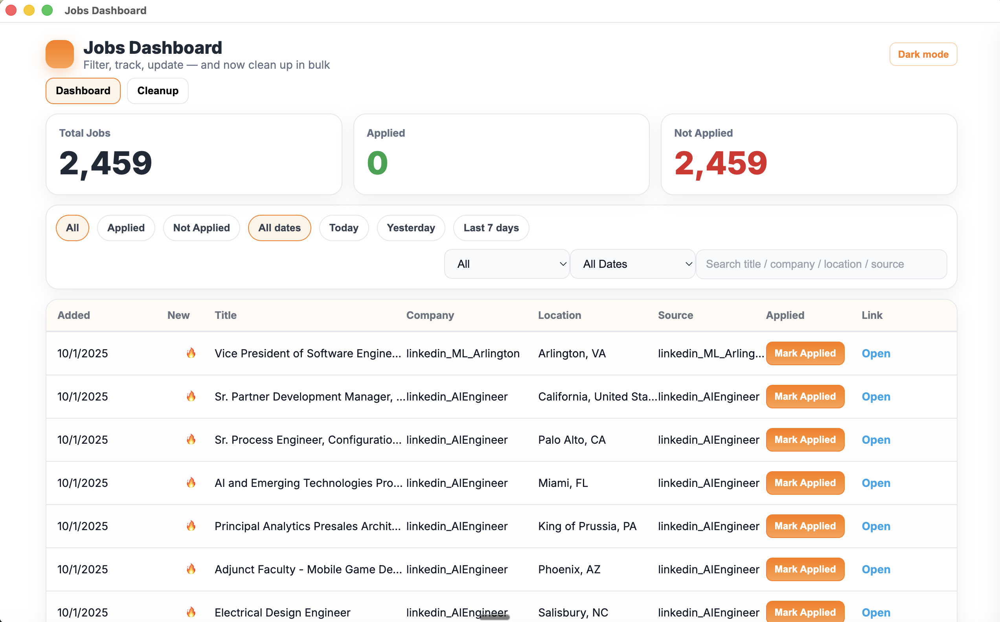
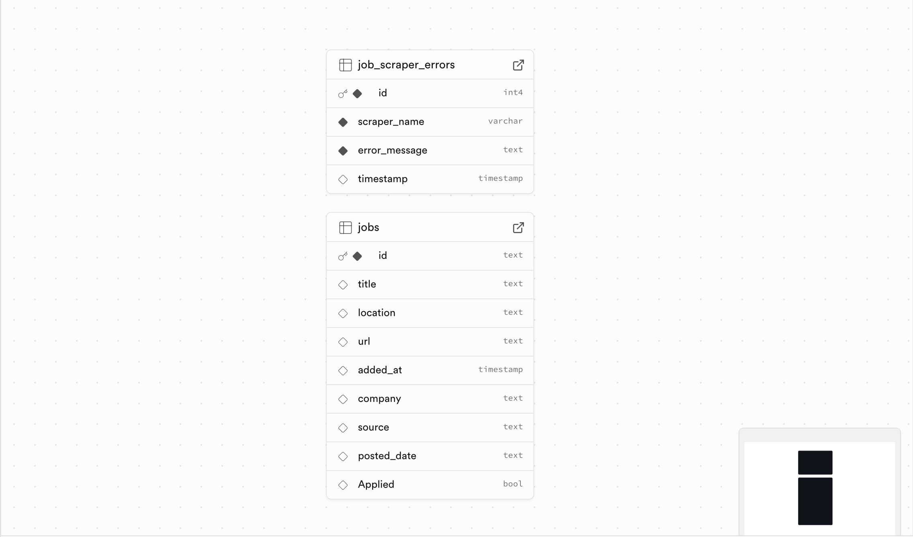
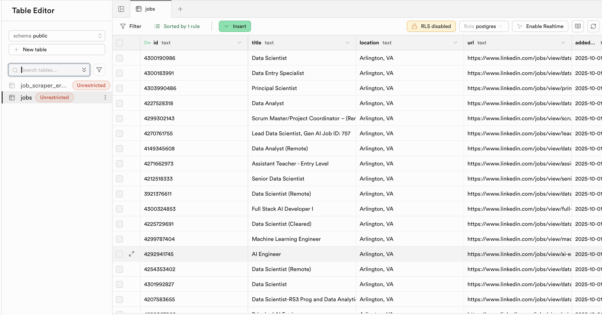

# Jobs Dashboard (Desktop)

Track, search, and manage job postings and applications in a fast desktop app built with **Electron + Vite + React** and **Supabase**.




<p align="center">
  <a href="#-features">Features</a> •
  <a href="#-tech-stack">Tech Stack</a> •
  <a href="#-quick-start">Quick Start</a> •
  <a href="#-configuration">Configuration</a> •
  <a href="#-database-schema">Database</a> •
  <a href="#-scripts">Scripts</a> •
  <a href="#-build--distribution">Build</a> •
  <a href="#-troubleshooting">Troubleshooting</a>
</p>

---

## ✨ Features

* **Job inbox**: add, edit, delete, and search job postings (title, company, location, source, status).
* **Smart search**: debounced search with “load more” pagination to avoid unnecessary API calls.
* **Freshness badges**: 🔥 for <3h, 🆕 for 3–10h, ⏱️ icon for 10–24h (configurable).
* **Apply state**: toggle “Applied” per row, or bulk actions.
* **Cleanup tab**: safely purge old records (e.g., “older than yesterday”, “older than 30 days”, past months).
* **Offline-friendly UI**: graceful Supabase error handling and optimistic updates.
* **Cross-platform packaging** (focused on macOS; Windows/Linux config included as notes).
* **Type-safe Electron main process** (optional TS config provided).

---

## 🧰 Tech Stack

* **Electron** (desktop shell)
* **Vite + React** (frontend)
* **Supabase** (Postgres + Auth + Storage)
* **ESLint** (quality)
* **electron-builder** (packaging)

---

## 🚀 Quick Start

### Prerequisites

* Node.js ≥ 18
* npm or pnpm
* A Supabase project (free tier OK)

### 1) Clone & install

```bash
git clone https://github.com/<you>/jobs-dashboard.git
cd jobs-dashboard
npm install
```

### 2) Configure environment

Create `.env` in the project root:

```bash
# Vite exposes these to the renderer
VITE_SUPABASE_URL=https://<your-project>.supabase.co
VITE_SUPABASE_ANON_KEY=<your-anon-key>
```

> Tip: Never commit secrets. Only the **anon** key should live in the client; use RLS policies to protect data.

### 3) Run in development

```bash
npm run dev
```

This starts Vite on `http://localhost:5173` and launches Electron with `VITE_DEV_SERVER_URL` injected.

---

## 🔧 Configuration

* **Environment**: Use `.env` (development) and `.env.production` (packaged builds).
* **Icons**: Place `build/icon.png` (1024×1024). Packaging generates platform assets.
* **Search**: Debounce interval and page size can be tweaked in `src/config.ts`.
* **Freshness thresholds**: Edit hours/icons in `src/utils/freshness.ts`.

---



## 🗄 Database Schema

Use this SQL in Supabase (SQL Editor) to create a minimal table with basic RLS:

```sql
create table if not exists jobs (
  id uuid primary key default gen_random_uuid(),
  title text not null,
  company text,
  location text,
  source text,
  url text,
  notes text,
  status text default 'saved', -- saved | applied | interviewing | offer | rejected
  posted_at timestamptz,      -- optional if scraped
  created_at timestamptz not null default now(),
  updated_at timestamptz not null default now()
);

-- Basic updated_at trigger
create or replace function set_updated_at()
returns trigger as $$
begin
  new.updated_at = now();
  return new;
end;
$$ language plpgsql;

drop trigger if exists jobs_set_updated_at on jobs;
create trigger jobs_set_updated_at
before update on jobs
for each row execute function set_updated_at();

-- RLS
alter table jobs enable row level security;

-- For single-user desktop, simplest policy is full access to anon (adjust if multi-user)
create policy "read jobs" on jobs for select using (true);
create policy "insert jobs" on jobs for insert with check (true);
create policy "update jobs" on jobs for update using (true);
create policy "delete jobs" on jobs for delete using (true);
```

> For multi-user scenarios, add an `owner` uuid column and policies tied to `auth.uid()`.



---

## 📁 Project Structure

```
jobs-dashboard/
├─ electron/
│  ├─ main.ts            # Electron main process (NodeNext module)
│  └─ tsconfig.json
├─ src/
│  ├─ App.jsx
│  ├─ lib/supabase.js
│  ├─ components/
│  │  ├─ JobTable.jsx
│  │  ├─ SearchBar.jsx
│  │  ├─ FreshnessBadge.jsx
│  │  └─ CleanupPanel.jsx
│  ├─ utils/freshness.ts
│  └─ config.ts
├─ public/
├─ build/                # icons, builder resources
├─ dist/                 # vite output
├─ .gitignore
├─ package.json
└─ README.md
```

---

## 📜 Scripts

From `package.json`:

```json
{
  "scripts": {
    "dev": "concurrently -k \"vite\" \"wait-on http://localhost:5173 && cross-env VITE_DEV_SERVER_URL=http://localhost:5173 electron .\"",
    "build": "vite build",
    "start:prod": "electron electron/main.js",
    "dist": "npm run build && electron-builder --mac"
  }
}
```

* `npm run dev` — Dev server + Electron
* `npm run build` — Production build (Vite)
* `npm run start:prod` — Run Electron against built assets
* `npm run dist` — Package a macOS app (`.dmg`/`.app`) with electron-builder

---

## 📦 Build & Distribution

### macOS (primary)

```bash
npm run dist
```

The packaged app appears under `dist/` (electron-builder output).
If you supply `build/icon.png`, electron-builder will generate `.icns`.

**Code signing / Notarization** (optional for local use):

* Configure `APPLE_ID`, `APPLE_APP_SPECIFIC_PASSWORD`, and `CSC_LINK/CSC_KEY_PASSWORD` as needed.
* See electron-builder docs for notarization setup.

### Windows/Linux (notes)

* Add corresponding `--win` / `--linux` targets or a `build` block in `package.json` to extend platforms.
* Provide `.ico` (Windows) and `.png` (Linux) icons under `build/`.

---

## 🧠 Data Loading & API Efficiency

* **Debounced search**: user typing triggers a debounced query.
* **Pagination**: initial page + “Load more” fetches the next batch (no infinite polling).
* **Selective refetch**: mutations invalidate only relevant queries (row or page scope).
* **Server-side filters**: apply `ilike`/`gte`/`lte` at Supabase query level—do not fetch all rows client-side.

---

## 🧹 Cleanup Tab (Bulk Delete)

The Cleanup tab offers preset filters:

* **Older than yesterday**
* **Older than 30 days**
* **Older than N months**
* **Only status = rejected / saved**

Deletes are:

* Previewed (shows count to be deleted)
* Executed in a single Supabase RPC or batched `delete()` with server-side filter
* Confirmed with modal + undo (optional soft-delete pattern if you add `deleted_at`)

> For very large datasets, prefer server-side deletion with a Postgres function.

---

## 🔒 Security

* Never embed service role keys in the client app.
* Keep **RLS enabled**; if you must allow anon, limit controls or switch to authenticated flow.
* Validate URLs (job `url` field) and sanitize notes before rendering.

---

## 🧪 Testing (optional)

* **Unit/UI**: Vitest + React Testing Library.
* **Integration**: Mock Supabase client; verify query parameters and pagination.

---

## 🗑 .gitignore

Make sure you ignore build artifacts:

```
dist
dist-electron
node_modules
.DS_Store
*.log
.env*
```

---

## 🩺 Troubleshooting

**White screen after packaging**

* Ensure `import.meta.env.VITE_DEV_SERVER_URL` is used **only** in dev. In production, load files from `dist/` (your `electron/main.ts` should detect env and set `BrowserWindow.loadFile('dist/index.html')`).

**Service worker / storage errors in dev**

* Quit all Electron instances; delete `~/Library/Application Support/<AppName>` cache; re-run `npm run dev`.

**TypeScript “No inputs were found” in `electron/tsconfig.json`**

* Make sure your `electron/` folder contains `.ts` files matching `"include": ["./**/*.ts"]`. If main is JS, change `tsconfig` or rename `main.ts` accordingly.

**Supabase `ilike` search error**

* Combine conditions as an OR array or chain filters correctly, e.g.:

  ```js
  const q = sb.from('jobs')
    .select('*')
    .or(`title.ilike.%${term}%,company.ilike.%${term}%,location.ilike.%${term}%,source.ilike.%${term}%`)
    .range(from, to);
  ```

---

## 🤝 Contributing

Issues and PRs are welcome. Please:

* Keep PRs focused and small.
* Add tests where reasonable.
* Update docs for user-facing changes.

---

## 📄 License

MIT © 2025 Your Name

---

## 📸 Screenshots

* `docs/hero.png` – Main dashboard
* `docs/cleanup.png` – Cleanup tab
* `docs/apply-state.png` – Apply toggle

*(Add real screenshots to the `docs/` folder and update filenames above.)*

---

## 🗺 Roadmap

* Authentication (multi-user)
* Import from LinkedIn/Greenhouse/Lever
* CSV export
* Calendar reminders & status timelines
* Advanced filters & tags

---

### Acknowledgments

Thanks to the Electron, Vite, React, and Supabase teams and community.

